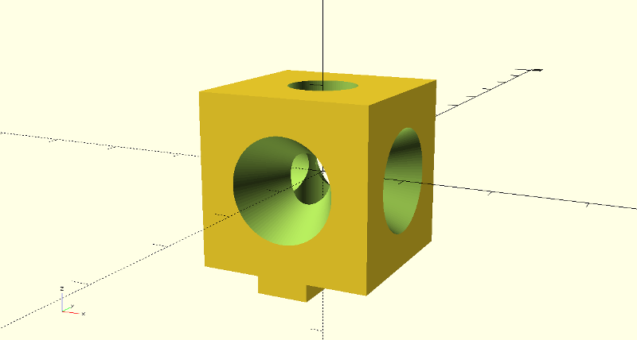

# 2020 Filament Guide

This is a funneled filament guide that bolts on to a 2020 aluminum extrusion. The STL has been rotated into an appropriate orientation for FDM printing. It's inspired by [walter's](https://www.thingiverse.com/walter/about) [Filament Guide Block](https://www.thingiverse.com/thing:866950).

## Printing Guidelines

The included part is small, has small tolerances, and some delicate geometries. It's very vulnerable to deformation melting. You can prevent this through some combination of:
  * using a cooling fan
  * choosing a slow print speed
  * printing multiples of this part, spaced well apart on your build platform

I avoided deformation by printing four of these parts at the same time and turning down my print speed.
